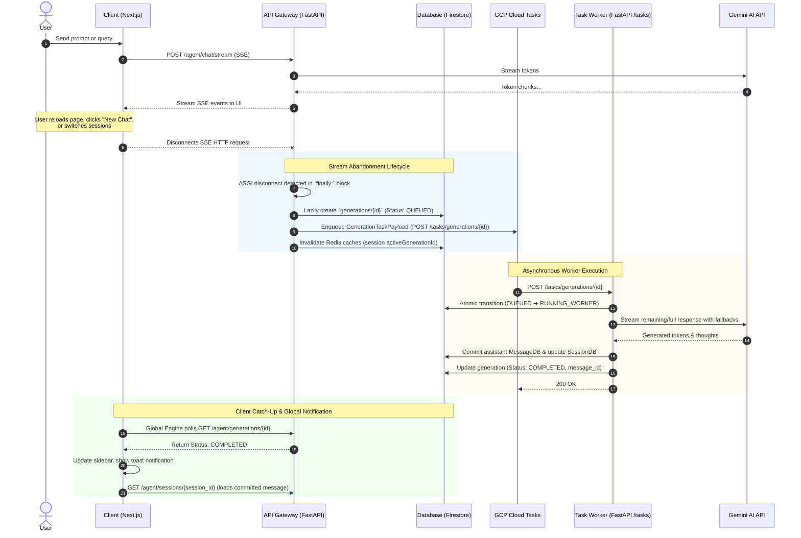

# Durable Background Generations Architecture

This document describes the end-to-end architecture, lifecycle, and data flow of **Durable Background Generations** in Cognito Chat.

---

## 1. Overview & Goals

In traditional AI chat applications, if a user reloads the browser, loses network connectivity, navigates to another session, or clicks "New Chat" while a model response is streaming, the generation is killed immediately. This leads to:
* Wasted user tokens and compute.
* Broken conversational state and lost messages.
* A locked, frustrating UI that blocks users from multitasking.

Cognito Chat solves this with a **durable, asynchronous background generation pipeline**. An ongoing stream can be abandoned by the client at any time without losing the response. The backend seamlessly transitions the in-flight generation to an asynchronous worker running via Google Cloud Tasks, streams tokens to completion, commits the final assistant message to Firestore, and notifies the client across tabs.

---

## 2. End-to-End Architecture & Sequence



---

## 3. Core Components

### A. Stream Disconnect Interceptor (`app/services/chats.py`)
During live SSE chat generation (`POST /agent/chat/stream`), the generator captures streaming state in a shared dictionary:
* `message_text`: The user prompt.
* `buffered_text`: Generated tokens emitted so far.
* `buffered_thoughts`: Model reasoning/thinking chunks.
* `resolved_model` & `resolved_reasoning`: SmartRouter decision metadata.

When the client closes the connection (tab closed, page reloaded, session switched, or new chat clicked), FastAPI's streaming response exits its loop and enters the `finally:` block:
1. It verifies if the generation finished naturally. If not completed, it invokes `handle_stream_abandonment(...)`.
2. A unique `GenerationDB` record is lazily created in Firestore with status `QUEUED`.
3. The task payload is enqueued to Google Cloud Tasks.
4. Redis session caches are invalidated so the session immediately reflects `active_generation_id`.

### B. Cloud Tasks Queue Dispatcher (`app/integrations/cloud_tasks.py`)
* Enqueues tasks to the dedicated GCP Cloud Tasks queue: `projects/.../locations/.../queues/cognito-generations`.
* Target URL: `{CLOUD_TASKS_WORKER_URL}/tasks/generations/{generation_id}`.
* Injects OIDC authentication tokens for secure worker invocation when running in Cloud Run environments.
* Configured with **tight, sub-second retry bounds**:
  * `min_backoff: 1s`, `max_backoff: 10s`, `max_doublings: 3`, `max_attempts: 5`.
  * Guarantees rapid dispatch without exponential queue stalling.

### C. Generation Worker Service (`app/services/generation_worker.py`)
The worker endpoint (`POST /tasks/generations/{generation_id}`) executes asynchronously and idempotently:
1. **Atomic Lock**: Calls `atomic_transition_status(generation_id, from_status=QUEUED, to_status=RUNNING_WORKER)`. If another worker or live stream already claimed or finished it, the worker cleanly exits.
2. **Context & Model Resolution**: Restores the session history and system prompt using `AgentService`.
3. **Execution & Fallback**: Invokes `GeminiProvider.generate_stream` with full fallback model support.
4. **Persistence**:
   - Commits the user message (if not already stored) and the final assistant response to Firestore `messages` subcollection.
   - Updates session statistics (`tokens_used`, `total_messages`, `updated_at`).
   - Sets the generation status to `COMPLETED` and clears `active_generation_id` from the parent session.

---

## 4. State Machine & Atomic Transitions

All generation status transitions are enforced using **Firestore Transactions** (`atomic_transition_status`):

```
                        ┌──────────────┐
                        │   (Start)    │
                        └──────┬───────┘
                               │
                      [Stream Abandoned]
                               │
                               ▼
                        ┌──────────────┐
                        │    QUEUED    │
                        └──────┬───────┘
                               │
                     [Worker Claims Task]
                               │
                               ▼
                     ┌──────────────────┐
                     │  RUNNING_WORKER  │
                     └──┬─────────────┬─┘
                        │             │
             [Stream Completed]   [Error / Timeout > 300s]
                        │             │
                        ▼             ▼
                 ┌───────────┐  ┌───────────┐
                 │ COMPLETED │  │  FAILED   │
                 └───────────┘  └───────────┘
```

| State | Description |
| :--- | :--- |
| `QUEUED` | Generation document created; waiting for Cloud Tasks worker pickup. |
| `RUNNING_LIVE` | Stream is actively sending tokens to an open client browser connection. |
| `RUNNING_WORKER`| Worker has acquired the generation lock and is streaming from Gemini in the background. |
| `COMPLETED` | Worker finished streaming, saved message to DB, and committed token usage. |
| `FAILED` | Worker encountered an unrecoverable provider error or exceeded safety timeout (300s). |
| `CANCELLED` | Explicitly cancelled by user action. |

---

## 5. Client Synchronization & Multi-Session Multitasking

The Next.js frontend integrates with durable generations at two levels:

### 1. Focused Session View (`ChatShell.tsx` & `useActiveGeneration`)
* When a user opens a session with an active background generation (`routeSessionId` matching `activeGenerationId`), the UI displays an animated generation state with partial buffered text.
* The chat shell polls `GET /agent/generations/{id}` with exponential backoff (2s up to 10s).
* When the generation status reaches `completed`, `useActiveGeneration` automatically invalidates React Query caches `["chat-session", sessionId]` and `["chat-sessions"]`, seamlessly replacing the placeholder with the persisted assistant message.

### 2. Global Application Engine (`useBackgroundGenerationsEngine.ts`)
* Runs globally in the background regardless of which route or session the user is currently viewing.
* Monitors `useGetSessions()` for any session containing an `activeGenerationId`.
* Maintains a real-time pulsing spinner on the sidebar next to any conversation currently generating in the background.
* Emits Sonner toast notifications upon completion:
  > *"Response ready for **{Chat Title}**"* with an instant "View" action button.

### 3. Non-Blocking Navigation & "New Chat" Action
* When the user clicks **"New chat"** or switches to another conversation while an AI response is generating:
  1. The client aborts its local SSE connection via `useChat.stop()`.
  2. The frontend navigates immediately to `/chat` or the selected session without blocking or showing error toasts.
  3. The backend detects the disconnect and offloads the original chat to the background worker.

---

## 6. Failure Handling & Auto-Expiration

1. **Client Reload Error Suppression**:
   - In `ChatShell.tsx`, `isUnloadingRef` and error filters suppress browser `AbortError`, network closed, and stream cancellation toasts so page refreshes are completely silent.
2. **Server-Side Generation Timeout Sweep**:
   - If a worker crashes or Cloud Tasks experiences an unexpected outage, generations whose `updated_at` timestamp exceeds **300 seconds (5 minutes)** are automatically transitioned to `FAILED` during active polling to prevent hung states.
3. **Database Idempotency**:
   - Message insertions check for existing message IDs before writing to avoid duplicate assistant messages if a worker retries.
